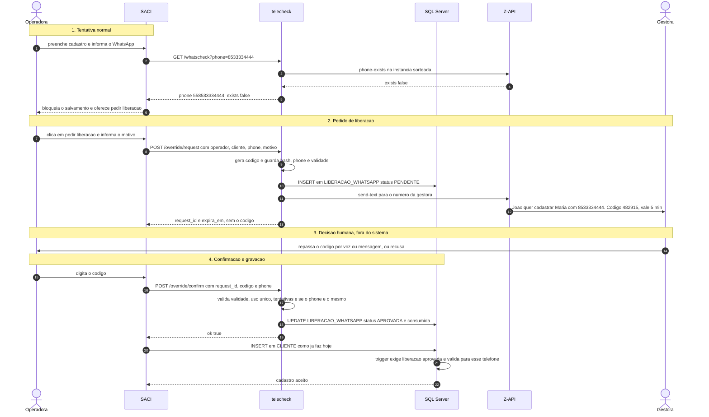

# Liberação de cadastro sem WhatsApp — guia de implementação

Documento de passagem de bastão. O lado **telecheck- está implementado**; o lado **SACI e o banco não**. Quem pegar isto continua do capítulo 5.

## 1. O problema

No cadastro de cliente do SACI, informar o WhatsApp é obrigatório e o número é verificado pela Z-API. Mas existem clientes legítimos sem WhatsApp (telefone fixo, cliente idoso, número de recado). A operadora precisa de uma saída, e essa saída não pode ficar na mão dela.

A solução é uma liberação pontual: a operadora pede, a **gestora** recebe um código no WhatsApp dela, repassa, e o cadastro passa. O código vale poucos minutos, serve **uma vez** e **só para aquele telefone**.

A regra que organiza tudo: **o código nunca passa pela máquina da operadora.** O servidor devolve para o SACI apenas um `request_id`. O código sai do servidor direto para o celular da gestora. Se o SACI recebesse o código, a operadora poderia lê-lo no tráfego ou no log e o controle seria encenação.

## 2. Fluxo completo



Se a gestora **recusa**, ela simplesmente não passa o código e o pedido morre no timeout. Não existe um "não" para o sistema processar. Registrar a recusa explicitamente exigiria webhook, e webhook exige expor a API para a internet — foi justamente o que este desenho evitou.

## 3. O que já está pronto no telecheck-

| Arquivo | O que é |
| --- | --- |
| `override.py` | Regra de negócio: gera código, valida, orquestra. Novo |
| `override_store.py` | Acesso à `LIBERACAO_WHATSAPP` no SQL Server. Novo |
| `db/schema.sql` | DDL da tabela. Novo, **ainda não aplicado** |
| `db/config.example.env` | Modelo da conexão ODBC. Novo |
| `override/config.example.env` | Número da gestora, TTL, tentativas, pepper. Novo |
| `whatsapp_client.py` | Escolhe o provedor (`zapi` ou `uazapi`), gira as instâncias e tem o `send_text`. Novo |
| `zapi_client.py` | Só o HTTP da Z-API, incluindo o envio de texto |
| `uazapi_client.py` | Só o HTTP da uazapi. Novo |
| `servidor.py` | Ganhou `/override/request` e `/override/confirm` |
| `requirements.txt` | Ganhou `pyodbc` |

### Contrato dos endpoints

**`POST /override/request`**

```json
{ "operador": "joao", "phone": "8533334444", "cliente_nome": "Maria", "motivo": "cliente sem celular", "ddd": null }
```

Sucesso 200 — repare que **o código não vem aqui**:

```json
{ "request_id": "xK3p9vQmZ1Ab", "phone": "558533334444", "expira_em": "2026-10-05T16:35:00", "validade_segundos": 300 }
```

**`POST /override/confirm`**

```json
{ "request_id": "xK3p9vQmZ1Ab", "codigo": "482915", "phone": "8533334444", "ddd": null }
```

Sucesso 200: `{"ok": true, "phone": "558533334444"}`

Erro 400: `{"error": true, "message": "Codigo invalido ou expirado", "tentativas_restantes": 2}`

| HTTP | Quando |
| --- | --- |
| 400 | código errado, expirado, já usado, ou telefone diferente do pedido |
| 503 | `override/config.env` incompleto, SQL Server inacessível, ou Z-API não entregou |

### Garantias implementadas

- Código de 6 dígitos com `secrets`, nunca `random`.
- No banco fica só o **HMAC-SHA256** de `request_id:codigo` com o `OVERRIDE_PEPPER`. O código em claro não é persistido em lugar nenhum.
- Comparação com `hmac.compare_digest`.
- **Uso único atômico**: o `UPDATE` de aprovação tem `WHERE LIB_STATUS = 'PENDENTE'` e confere `rowcount`. Duas confirmações simultâneas não passam as duas.
- **Preso ao telefone**: o `confirm` recusa se o telefone não for o mesmo do pedido.
- Limite de tentativas; ao estourar, o código vira `BLOQUEADA`.
- Código errado, expirado, consumido e telefone trocado devolvem **a mesma frase**, de propósito. Dizer qual dos quatro falhou entrega informação para quem está adivinhando.
- Auditoria nasce no **pedido**, não na aprovação, então tentativas abandonadas e recusadas também ficam gravadas.
- `pyodbc` é importado dentro de `_connect()`, não no topo do módulo, para o serviço subir e o `/whatscheck` continuar funcionando numa máquina sem o driver.

## 4. Setup no servidor Windows

```powershell
cd C:\Users\tarciopontes\Documents\_Victor\telecheck-
git pull
.\.venv\Scripts\python.exe -m pip install -r requirements.txt
```

O `pyodbc` precisa do **ODBC Driver 17 ou 18 for SQL Server** instalado na máquina. Confira com:

```powershell
Get-OdbcDriver -Name "*SQL Server*"
```

Copie e preencha os dois configs (ambos ficam fora do git por `**/config.env`):

```powershell
copy db\config.example.env db\config.env
copy override\config.example.env override\config.env
```

Em `db\config.env` vai a connection string **em formato ODBC**. O SACI usa OLE DB em `C:\Arquivos Saci\conexao.udl` com `Provider=SQLOLEDB.1` — servidor e banco são os mesmos, só a sintaxe muda. Abra o `.udl` num editor de texto para pegar `SERVER` e `DATABASE`.

Em `override\config.env`, gere o pepper:

```powershell
.\.venv\Scripts\python.exe -c "import secrets; print(secrets.token_urlsafe(32))"
```

Aplique o DDL no SSMS. O `db/schema.sql` é **aditivo**: cria uma tabela nova e não toca em `CLIENTE`, então pode rodar antes de o SACI estar adaptado.

## 5. Implementação no SACI

Nada foi alterado no SACI. O ponto de entrada é `uCadastrarCliFor.pas`.

### 5.1 Onde enfiar a verificação

`btnConfirmarClick` começa na **linha 397**. A cadeia de validações obrigatórias termina na **linha 415** (`dblOrigem`), e a decisão entre INSERT e UPDATE está na **linha 418** (`if btnEditar.Visible=false then`), com o `INSERT INTO CLIENTE` na **431** e o `UPDATE CLIENTE` na **459**.

A verificação de WhatsApp e o fluxo de liberação entram **entre a linha 415 e a 418**: depois de todas as validações, antes de qualquer escrita.

O campo é `edtWhatsApp` (declarado na linha 139). O formato esperado hoje está na linha 590: DDD + 9 + 8 dígitos, ou seja 11 caracteres.

### 5.2 Base URL configurável

Não cravar o IP no código. O SACI já lê configuração de `C:\Arquivos Saci\conf.ini` (veja `TIniFile` na linha 593). Acrescente uma seção:

```ini
[Telecheck]
BaseUrl=http://192.168.0.125:8080
```

### 5.3 Esboço das três chamadas

O precedente de HTTP no SACI é o `THttpClient` em `uWebhook.pas`. **Hoje o SACI não chama o telecheck- em lugar nenhum** — esta é a primeira integração.

```pascal
uses
  System.Net.HttpClient, System.JSON, System.Classes, System.SysUtils, IniFiles;

function TelecheckBaseUrl: string;
var Ini: TIniFile;
begin
  Ini := TIniFile.Create('C:\Arquivos Saci\conf.ini');
  try
    Result := Ini.ReadString('Telecheck', 'BaseUrl', 'http://192.168.0.125:8080');
  finally
    Ini.Free;
  end;
end;

function PostJson(const Caminho: string; Corpo: TJSONObject; out Resposta: TJSONObject): Integer;
var
  Http: THTTPClient;
  Stream: TStringStream;
  Resp: IHTTPResponse;
begin
  Http := THTTPClient.Create;
  Stream := TStringStream.Create(Corpo.ToString, TEncoding.UTF8);
  try
    Http.ContentType := 'application/json';
    Resp := Http.Post(TelecheckBaseUrl + Caminho, Stream);
    Result := Resp.StatusCode;
    Resposta := TJSONObject.ParseJSONValue(Resp.ContentAsString(TEncoding.UTF8)) as TJSONObject;
  finally
    Stream.Free;
    Http.Free;
  end;
end;

// 1. O numero tem WhatsApp?
function WhatsAppExiste(const Numero: string): Boolean;
var
  Http: THTTPClient;
  Resp: IHTTPResponse;
  Json: TJSONObject;
begin
  Http := THTTPClient.Create;
  try
    Resp := Http.Get(TelecheckBaseUrl + '/whatscheck?phone=' + Numero);
    if Resp.StatusCode <> 200 then
      raise Exception.Create('telecheck- indisponivel: ' + Resp.StatusText);
    Json := TJSONObject.ParseJSONValue(Resp.ContentAsString(TEncoding.UTF8)) as TJSONObject;
    try
      Result := Json.GetValue<Boolean>('exists');
    finally
      Json.Free;
    end;
  finally
    Http.Free;
  end;
end;
```

O `request` devolve o `request_id`, que o form guarda numa variável de instância até a confirmação. O `confirm` manda `request_id`, `codigo` e **o mesmo telefone**, e só libera o salvamento com `ok = true`.

### 5.4 Fluxo de tela sugerido

1. Operadora clica em Confirmar.
2. Se `WhatsAppExiste` devolve `true`, segue o fluxo atual sem mudança nenhuma.
3. Se devolve `false`, avisa "este número não tem WhatsApp" e oferece **Pedir liberação**.
4. Ao pedir, abre um campo de motivo, chama o `request` e mostra "código enviado à gestora, válido por 5 minutos".
5. Mostra o campo do código. Ao confirmar, chama o `confirm`.
6. Com `ok = true`, executa o INSERT ou UPDATE que já existe.
7. Com erro, mostra a `message` e as `tentativas_restantes`.

### 5.5 Os outros dois forms

`CLI_WHATSAPP` é gravado em **três** lugares, não um:

| Arquivo | Linhas |
| --- | --- |
| `uCadastrarCliFor.pas` | 449 (INSERT) e 467 (UPDATE) |
| `uProspecClientes.pas` | 119 |
| `uAdmRotas.pas` | 779 |

Adaptar só o `uCadastrarCliFor` deixa dois caminhos abertos. Decida se a regra vale para os três — e é exatamente por isso que a trigger do capítulo 6 importa, porque ela cobre os três de uma vez.

## 6. Impor a regra no banco

Aqui está o limite honesto do desenho, e ele precisa ser entendido antes de escrever a trigger.

**A trigger não consegue saber se um número tem WhatsApp.** Isso só a Z-API responde. Então uma trigger que exija "`CLI_WHATSAPP` preenchido **ou** liberação aprovada" não resolve o problema real: a operadora digita um número falso qualquer, o campo fica preenchido, e a trigger aprova.

Há duas saídas:

**Opção A — confiar no SACI.** A trigger só confere que, quando existe uma liberação aprovada recente para aquele telefone, ela seja marcada como consumida por aquele `CLI_CODIGO`. A regra de "verificou e deu false" continua morando no Delphi. É simples, e é um controle interno adequado contra uma operadora, mas é contornável por quem souber mexer no banco direto.

**Opção B — registrar também as verificações.** O `/whatscheck` passa a gravar cada verificação numa tabela `VERIFICACAO_WHATSAPP` (telefone, resultado, horário), e a trigger exige, para cada cadastro, **ou** uma verificação recente com `exists = true`, **ou** uma liberação aprovada. Aí a regra fica realmente no banco e não dá para contornar pelo formulário. Custa uma tabela a mais, uma escrita por verificação, e uma decisão sobre validade da verificação.

A Opção B é a correta se o objetivo é controle de verdade. Ela **não** está implementada — o `/whatscheck` hoje não grava nada.

Em qualquer uma das duas: **não crie a trigger antes de o SACI estar adaptado.** No instante em que ela existir, o cadastro do SACI atual para de funcionar. A ordem é adaptar o Delphi, testar, e só então criar a trigger.

## 7. Premissas que eu assumi

**A liberação dispensa o WhatsApp, não o formato.** O `canonical_phone` do `override.py` usa o `normalize_phone` estrito: um número que não pode existir no plano de numeração brasileiro (DDD inexistente, fixo fora da faixa 2–5, celular fora da faixa 9 + 6–9) é recusado com **400 antes** de a gestora receber qualquer mensagem. O que a liberação permite é cadastrar um número **válido que não tem WhatsApp** — não um número impossível. As regras estão em `ESPECIFICACAO_ROTINAS.md`, seção "Validação do número".

**Uma gestora só.** O `OVERRIDE_GESTORA_PHONE` é um número único. Para vários aprovadores, a coluna `LIB_GESTORA_PHONE` já existe e aguenta, mas a escolha de quem recebe teria de ser implementada.

**Horário local.** As datas usam `datetime.now()` sem timezone, para bater com o `SYSDATETIME()` do SQL Server nas consultas de auditoria do `schema.sql`.

## 8. Teste — não executado

Nada foi testado, por decisão explícita, para não gastar chamadas da Z-API. O que foi feito: compilação de todos os módulos e verificação de lints, ambos limpos. **Toda a validação funcional está pendente.**

Roteiro mínimo, na ordem, já no servidor Windows:

1. `/health` responde — o serviço sobe com os módulos novos.
2. `/override/request` **sem** `override/config.env` → espera 503 `Liberacao nao configurada no servidor`.
3. Com config e **sem** `db/config.env` → espera 503 com a mensagem do `DB_ODBC_CONNECTION_STRING`.
4. Com os dois configs → espera 200 com `request_id`, a linha `PENDENTE` no banco, e a mensagem chegando no celular da gestora. **Esta é a primeira chamada que gasta Z-API.**
5. `/override/confirm` com o código certo → 200 `ok true` e a linha vira `APROVADA` com `LIB_CONSUMIDO_EM`.
6. Repetir o mesmo `confirm` → espera 400, porque o uso é único.
7. Novo pedido, confirmar com **outro** telefone → espera 400 mesmo com o código certo.
8. Novo pedido, errar o código 3 vezes → espera `tentativas_restantes` caindo 2, 1, 0 e o status virando `BLOQUEADA`.
9. Novo pedido, esperar passar o TTL → espera 400 e status `EXPIRADA`.

Vale conferir também que o código **não aparece** na resposta do `request` nem em log nenhum, e que na tabela só existe o hash.

## 9. Pontos abertos

**Quem é o `operador`.** O INSERT da linha 445 e o UPDATE da linha 470 cravam `USU_CODIGO=38` no código. Ou seja, a rastreabilidade de "quem cadastrou" já está quebrada no SACI hoje, independente desta feature. O `operador` do `/override/request` precisa vir do usuário logado de verdade, senão a auditoria nova nasce com o mesmo defeito. Descobrir de onde tirar isso é tarefa do lado SACI.

**O código trafega pelo Z-API**, que é um terceiro. Para um código interno de exceção isso é provavelmente aceitável, mas não é um canal próprio.

**SQL injection no cadastro.** Os INSERT e UPDATE de `CLI_WHATSAPP` são concatenação de string direto dos campos do form (linhas 449 e 467). Um cliente chamado `D'Ávila` já quebra o comando. É um problema anterior e independente desta feature, mas quem for mexer nesse arquivo passa ao lado dele.

**Limpeza da tabela.** Nada remove liberações antigas. Como é trilha de auditoria, o certo é manter e arquivar, não apagar — mas convém decidir por quanto tempo.
